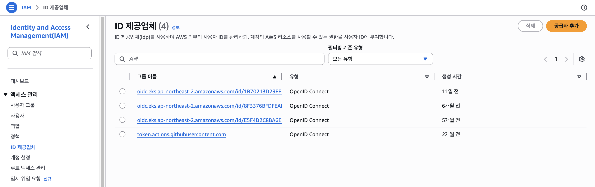
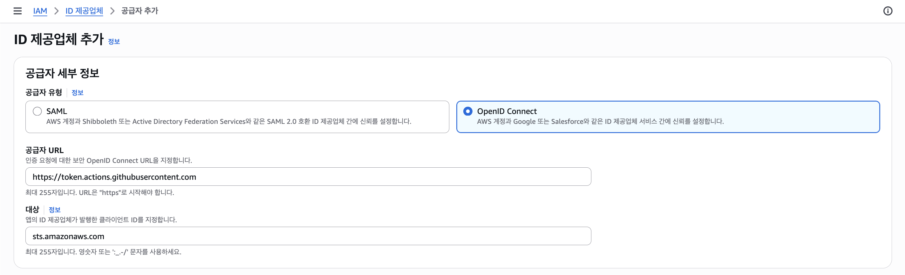
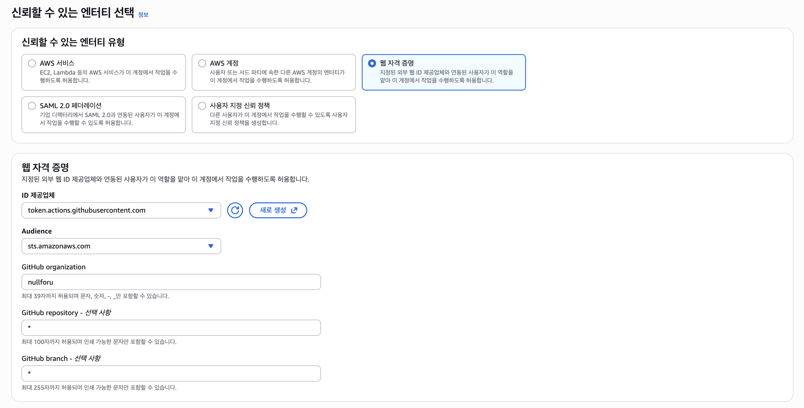
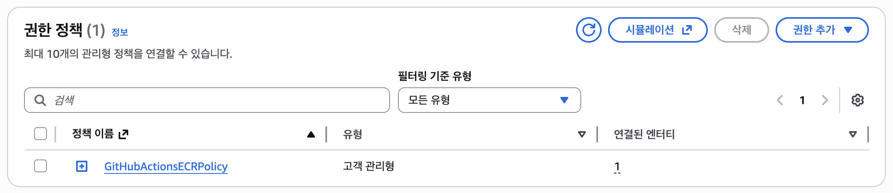
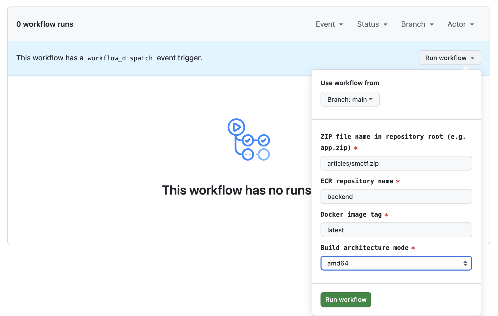

# GitHub Actions OIDC with AWS ECR

## AWS OIDC Provider



- Provider URL: `https://token.actions.githubusercontent.com`
- Audience: `sts.amazonaws.com`



## IAM Role (ECR)

- Role Name: `GitHubActionsECRRole`

### A) Web Identity



### B) Custom Trust Policy

- Role Type: `Custom trust policy`

```json
{
    "Version": "2012-10-17",
    "Statement": [
        {
            "Effect": "Allow",
            "Principal": {
                "Federated": "arn:aws:iam::<ACCOUNT_ID>:oidc-provider/token.actions.githubusercontent.com"
            },
            "Action": "sts:AssumeRoleWithWebIdentity",
            "Condition": {
                "StringEquals": {
                    "token.actions.githubusercontent.com:aud": "sts.amazonaws.com"
                },
                "StringLike": {
                    "token.actions.githubusercontent.com:sub": "repo:<ORG>/<REPO>:ref:refs/heads/main"
                }
            }
        }
    ]
}
```

- `REPO` should be replaced with `*`(wildcard) if you want to allow all Github repositories.

## IAM Policy (ECR)

- Policy Name: `GitHubActionsECRPolicy`

```json
{
    "Version": "2012-10-17",
    "Statement": [
        { "Sid": "ECRAuth", "Effect": "Allow", "Action": ["ecr:GetAuthorizationToken"], "Resource": "*" },
        {
            "Sid": "ECRPushPull",
            "Effect": "Allow",
            "Action": [
                "ecr:BatchCheckLayerAvailability",
                "ecr:BatchGetImage",
                "ecr:CompleteLayerUpload",
                "ecr:DescribeRepositories",
                "ecr:InitiateLayerUpload",
                "ecr:PutImage",
                "ecr:UploadLayerPart"
            ],
            "Resource": "arn:aws:ecr:<AWS_REGION>:<ACCOUNT_ID>:repository/<ECR_REPOSITORY>"
        }
    ]
}
```

- `ECR_REPOSITORY` should be replaced with `*`(wildcard) if you want to allow all ECR repositories.

## IAM Role Policy Attachment



## Github Repository Secrets

- `AWS_REGION`: `ap-northeast-2`
- `AWS_ACCOUNT_ID`: `<ACCOUNT_ID>`
- `AWS_ROLE_NAME`: `GitHubActionsECRRole`

# How to Use


